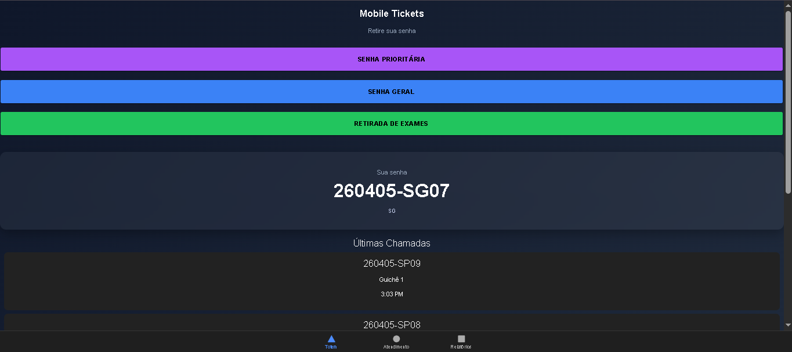
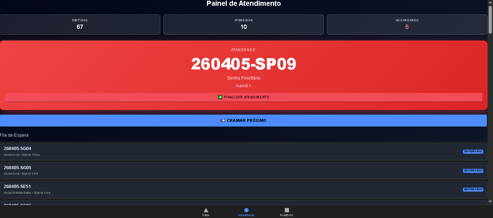
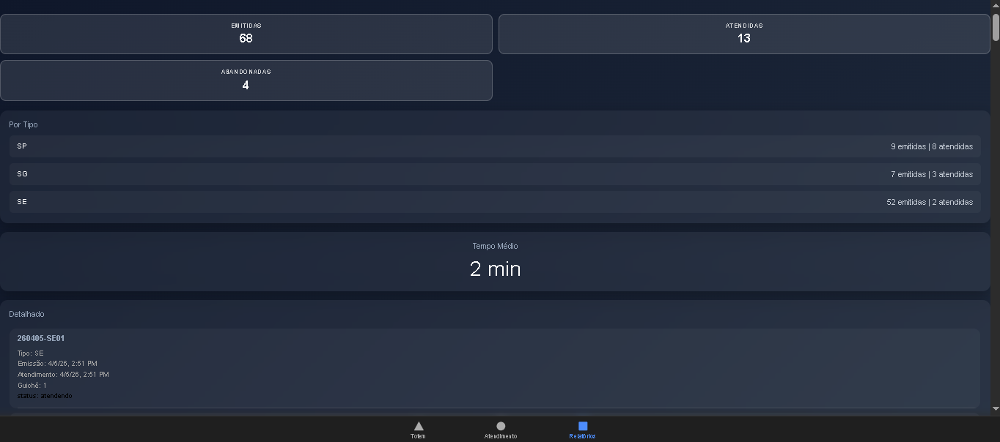

# Sistema de Controle de Atendimento

## Participantes
* Lucas Rafael da Silva Alves - 01849525
* Silvan Guilherme de Barros Souza - 01864557
* Matheus Lopes Viana Carvalho - 01590039

## 1. Introdução

Este projeto tem como objetivo o desenvolvimento de um sistema de controle de atendimento, simulando um ambiente real de gerenciamento de filas com múltiplos níveis de prioridade.

A aplicação permite a emissão de senhas, organização da fila de atendimento, controle de chamadas e geração de relatórios estatísticos, seguindo regras específicas definidas em enunciado.

---

## 2. Objetivos

### 2.1 Objetivo Geral

Desenvolver um sistema capaz de gerenciar filas de atendimento com diferentes níveis de prioridade, garantindo organização, rastreabilidade e geração de informações gerenciais.

### 2.2 Objetivos Específicos

* Implementar geração de senhas padronizadas
* Aplicar regras de prioridade no atendimento
* Simular tempos de atendimento
* Implementar regra de abandono
* Gerar relatórios detalhados e consolidados
* Exibir painel de chamadas

---

## 3. Regras de Negócio

### 3.1 Formato das Senhas

As senhas seguem o padrão:

```id="kzjlwm"
YYMMDD-PPSQ
```

Onde:

* YY: ano da emissão (2 dígitos)
* MM: mês da emissão
* DD: dia da emissão
* PP: tipo da senha (SP, SG, SE)
* SQ: sequência diária por tipo

Exemplo:

```id="a8b2u6"
260404-SP01
```

---

### 3.2 Tipos de Atendimento

* SP (Prioritário)
* SG (Geral)
* SE (Simples)

---

### 3.3 Política de Atendimento

A ordem de chamada segue a prioridade:

1. SP (prioritário)
2. SE (simples)
3. SG (geral)

Em caso de empate, é respeitada a ordem de emissão (FIFO).

---

### 3.4 Tempo de Atendimento

* SP: 15 minutos com variação de ±5 minutos
* SG: 5 minutos com variação de ±3 minutos
* SE:

  * 95% dos atendimentos com duração de 1 minuto
  * 5% dos atendimentos com duração de 5 minutos

---

### 3.5 Regra de Abandono

Para senhas do tipo SE, existe uma probabilidade de 5% de abandono, simulando desistência do atendimento.

---

## 4. Funcionalidades do Sistema

* Emissão de senhas por tipo
* Organização automática da fila
* Chamada de senhas com atribuição de guichê
* Finalização de atendimento
* Painel com últimas chamadas
* Geração de relatórios

---

## 5. Relatórios

O sistema disponibiliza:

* Total de senhas emitidas
* Total de senhas atendidas
* Quantidade por tipo de senha
* Quantidade atendida por tipo
* Tempo médio de atendimento
* Relatório detalhado contendo:

  * Número da senha
  * Tipo
  * Data e hora de emissão
  * Data e hora de atendimento
  * Guichê responsável

---

# 6. Imagens do Sistema

### Tela Totem (emissão de senhas)
 

### Tela de atendimento


### Tela de Relatórios


## 7. Tecnologias Utilizadas

* Angular
* Ionic
* TypeScript
* HTML
* SCSS

---

## 8. Estrutura do Sistema

```id="3r8nwb"
src/
 ├── app/
 │   ├── tab1/ (Emissão e painel de chamadas)
 │   ├── tab2/ (Fila de atendimento)
 │   ├── tab3/ (Relatórios)
 │   ├── services/
 │   │   └── ticket.service.ts
```

---

## 9. Decisões de Projeto

* Utilização de armazenamento em memória para simplificação do sistema
* Separação da lógica de negócio em serviço (TicketService)
* Uso de componentes por funcionalidade (tabs)
* Implementação de regras diretamente no serviço para centralização da lógica

---

## 10. Limitações

* Não há persistência em banco de dados
* Dados são perdidos ao recarregar a aplicação
* Sistema não possui autenticação

---

## 11. Possíveis Melhorias

* Integração com backend (Node.js + MySQL)
* Persistência de dados
* Dashboard com gráficos
* Controle de usuários e autenticação
* Exportação de relatórios

---

## 12. Conclusão

O sistema atende aos requisitos propostos, implementando corretamente as regras de negócio e fornecendo uma simulação funcional de um ambiente de atendimento.

A aplicação demonstra conceitos importantes como organização de filas, priorização, manipulação de dados e geração de relatórios.

---
